<p align="center">
  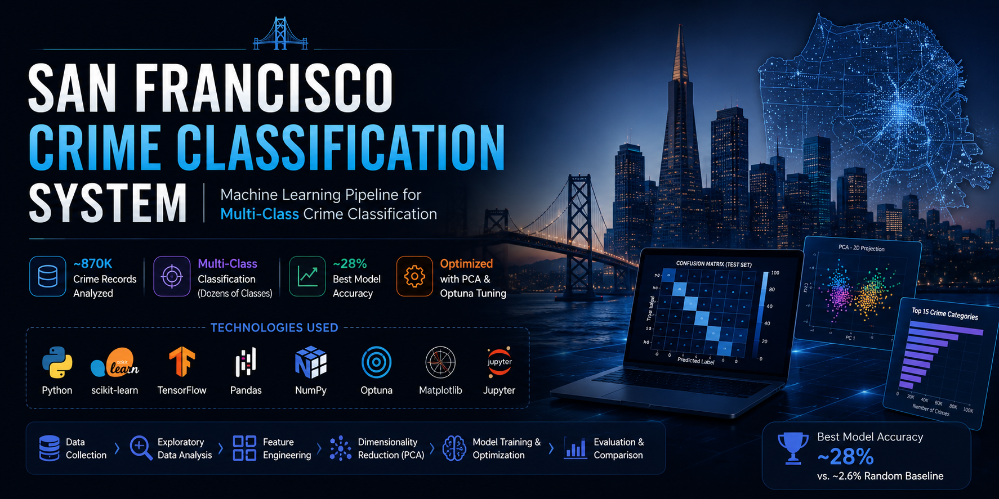
</p>

<h1 align="center">San Francisco Crime Classification System</h1>

<p align="center">
  🚔 A machine learning system that predicts the category of a crime in San Francisco based on historical crime records.<br>
  Tackles a <b>highly imbalanced, multi-class classification problem</b> using approximately <b>870,000 crime records</b>,<br>
  combining feature engineering, dimensionality reduction (PCA), and hyperparameter optimization to compare multiple ML algorithms.
</p>

<p align="center">
  
  
  
  
  
  
  
  
  
  
</p>

<p align="center">
  The best-performing model achieved <b>~28% accuracy</b>, significantly outperforming the random baseline of <b>~2.6%</b> across dozens of crime categories.
</p>

---

## 📚 Table of Contents

- [📋 Project Summary](#-project-summary)
- [⭐ Key Features](#-key-features)
- [💡 Why This Project?](#-why-this-project)
- [📌 Project Overview](#-project-overview)
- [🗂️ Dataset](#️-dataset)
- [🔄 Workflow](#-workflow)
- [📷 Visual Results](#-visual-results)
- [📊 Exploratory Data Analysis](#-exploratory-data-analysis)
- [🧩 Principal Component Analysis (PCA)](#-principal-component-analysis-pca)
- [🤖 Models Used](#-models-used)
- [⚙️ Hyperparameter Optimization](#️-hyperparameter-optimization)
- [🏆 Results](#-results)
- [📈 Model Performance Comparison](#-model-performance-comparison)
- [🧠 Neural Network Training](#-neural-network-training)
- [🧮 Confusion Matrices](#-confusion-matrices)
- [🧠 Skills Demonstrated](#-skills-demonstrated)
- [🛠️ Technologies](#️-technologies)
- [📁 Repository Structure](#-repository-structure)
- [🚀 Installation](#-installation)
- [🔮 Future Improvements](#-future-improvements)
- [📄 License](#-license)

---

## 📋 Project Summary

<div align="center">

| Aspect | Details |
|:---|:---|
| **Problem** | Multi-class crime category prediction |
| **Dataset Size** | ~870,000 crime records |
| **Best Model** | Neural Network |
| **Best Accuracy** | ~28% |
| **Baseline Accuracy** | ~2.6% (random baseline) |
| **Language** | Python |
| **Frameworks** | Scikit-learn, TensorFlow, Optuna |

</div>

---

## ⭐ Key Features

| | |
|---|---|
| 🔗 **End-to-End ML Pipeline** | From raw data to final evaluation |
| 📦 **Large-scale Dataset** | ~870K real-world crime records |
| 🎯 **Multi-class Classification** | Dozens of distinct crime categories |
| 🧪 **Feature Engineering** | Meaningful spatial and temporal signals |
| 🧩 **PCA Dimensionality Reduction** | Reduced noise, improved training efficiency |
| ⚙️ **Hyperparameter Optimization** | Automated, reproducible tuning with Optuna |
| ⚖️ **Class Imbalance Handling** | Techniques to address skewed category distributions |
| 🤖 **Model Comparison** | Logistic Regression, Decision Tree, SVM, Neural Network |
| 🔁 **Reproducible Experiments** | Persisted studies and consistent evaluation methodology |

---

## 💡 Why This Project?

This repository demonstrates a complete, end-to-end machine learning workflow applied to a real-world, large-scale dataset — covering data preprocessing, feature engineering, dimensionality reduction with PCA, comparison across multiple modeling approaches, automated hyperparameter optimization with Optuna, and rigorous evaluation, making it a comprehensive showcase of practical, production-style ML development.

---

## 📌 Project Overview

Predicting crime categories from historical incident data is a classic yet challenging real-world machine learning problem. Law enforcement agencies and urban planners can benefit from data-driven insights into crime patterns, but the task is far from trivial.

**Objectives:**
- Build a multi-class classification pipeline capable of predicting one of many possible crime categories from incident metadata (location, time, district, etc.).
- Compare classical machine learning models against a neural network approach.
- Apply systematic feature engineering and dimensionality reduction to improve model performance.
- Use automated hyperparameter optimization to fairly and efficiently tune each model.

**Why is this challenging?**
- 🎯 **Severe class imbalance** — a small number of crime categories (e.g., theft) dominate the dataset, while many others are rare, making it hard for models to learn minority classes.
- 🌆 **High cardinality & noisy features** — categorical variables such as location and district introduce complexity.
- 🔀 **Overlapping feature distributions** — many crime types share similar temporal and spatial patterns, blurring decision boundaries.
- 📊 **Large-scale data** — ~870K records require efficient preprocessing and training pipelines.

---

## 🗂️ Dataset

The dataset consists of historical San Francisco crime incident records.

| Property | Description |
|:---|:---|
| **Samples** | ~870,000 crime records |
| **Target Variable** | Crime category (multi-class) |
| **Class Distribution** | Severely imbalanced across categories |
| **Feature Types** | Multiple numerical and categorical features (e.g., time-based, spatial, and categorical descriptors) |

> ⚠️ No metrics or feature names beyond what is described here are assumed. Refer to the notebook for the full data dictionary and preprocessing details.

---

## 🔄 Workflow

<p align="center">
  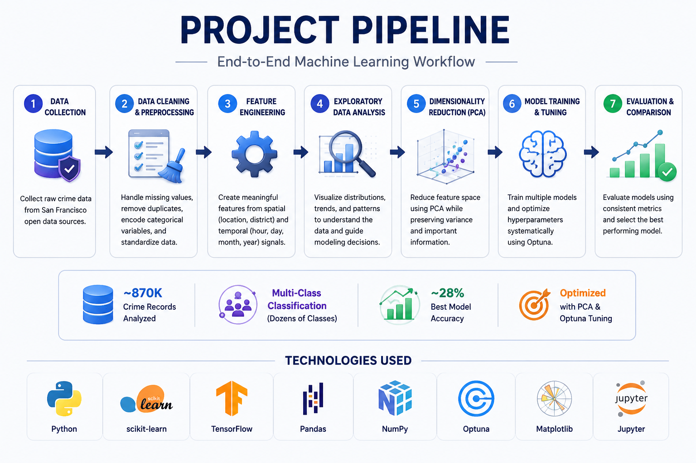
</p>

The workflow follows a structured, end-to-end machine learning process. Raw crime data is collected and cleaned, meaningful features are engineered from spatial and temporal signals, patterns are explored through EDA, dimensionality is reduced via PCA, multiple models are trained and systematically tuned with Optuna, and final performance is assessed through rigorous, consistent evaluation.

---

## 📷 Visual Results

This repository includes a complete set of visual assets documenting the analysis and modeling process, including:

- 📊 **Exploratory Data Analysis** — class distribution and pattern discovery
- 🧩 **PCA Visualization** — dimensionality reduction and class separability
- 📈 **Model Comparison** — accuracy across all evaluated algorithms
- 🧠 **Neural Network Training** — loss curve across training epochs
- 🧮 **Confusion Matrices** — per-model classification behavior, including train/test views for the Neural Network

---

## 📊 Exploratory Data Analysis

Exploratory Data Analysis (EDA) was performed to understand the distribution of crime categories, uncover temporal and spatial patterns, and inform feature engineering decisions ahead of modeling.

<p align="center">
  
</p>

*Distribution of crime categories, highlighting the severe class imbalance present in the dataset.*

<p align="center">
  
</p>

*Patterns in crime occurrences across key dimensions such as time or location, used to guide feature engineering decisions.*

<p align="center">
  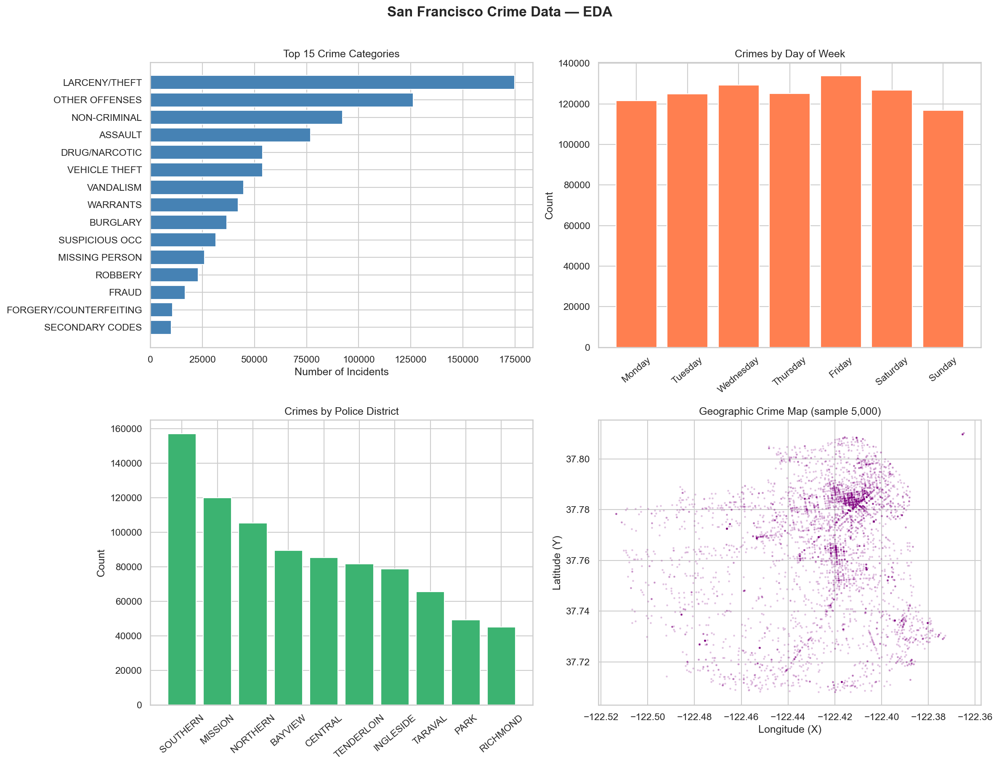
</p>

*A high-level overview of the dataset's structure, summarizing the key variables and distributions explored during analysis.*

<p align="center">
  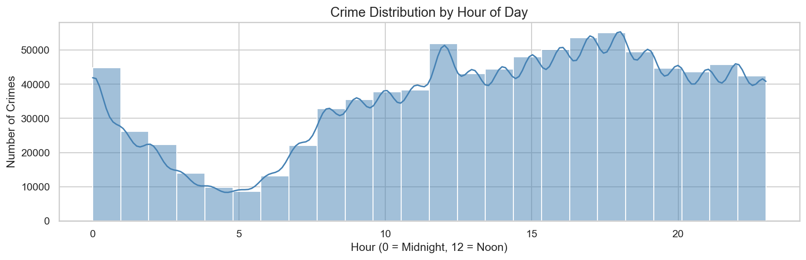
</p>

*Distribution of crime incidents by hour of day, revealing peak activity periods across the 24-hour cycle.*

<p align="center">
  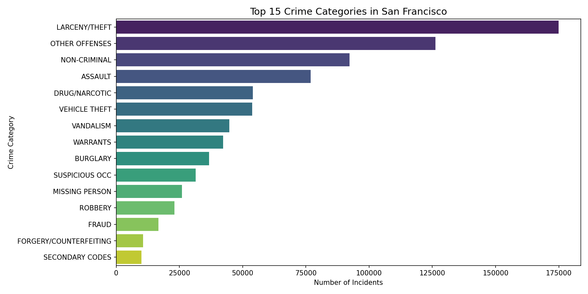
</p>

*The 15 most frequent crime categories, illustrating the dominance of a small number of classes within the dataset.*

<p align="center">
  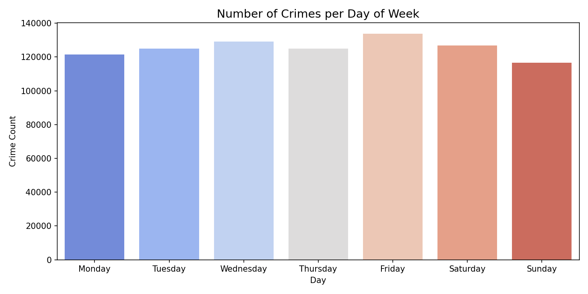
</p>

*Daily crime volume across the observed period, offering insight into short-term trends and reporting consistency.*

<p align="center">
  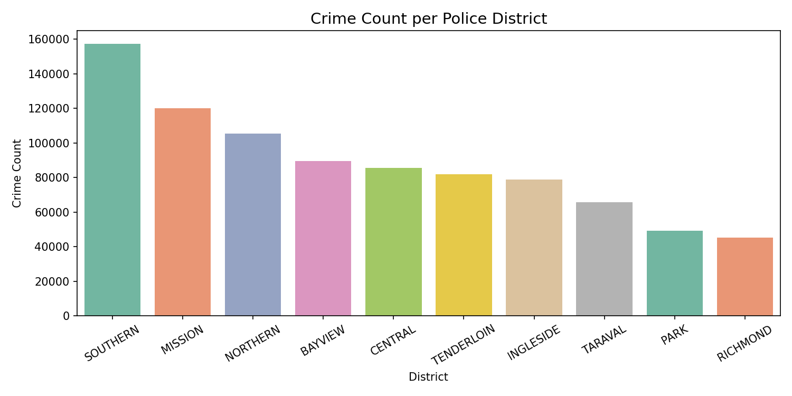
</p>

*Distribution of crime incidents across San Francisco police districts, highlighting geographic hotspots.*

<p align="center">
  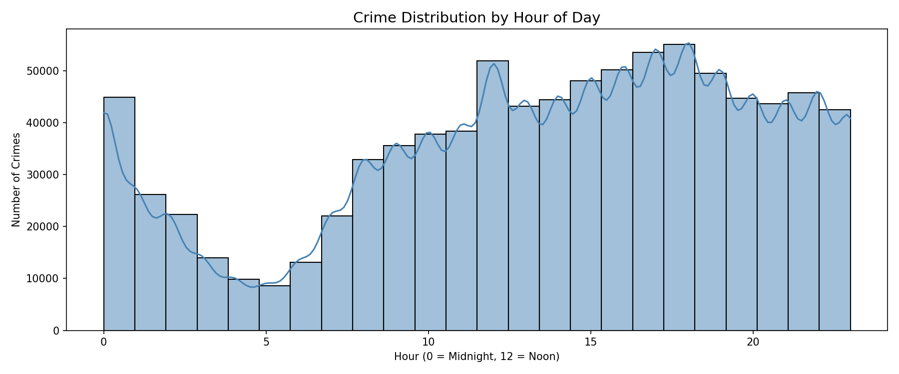
</p>

*A closer look at hourly crime trends, reinforcing patterns identified in the earlier time-based analysis.*

<p align="center">
  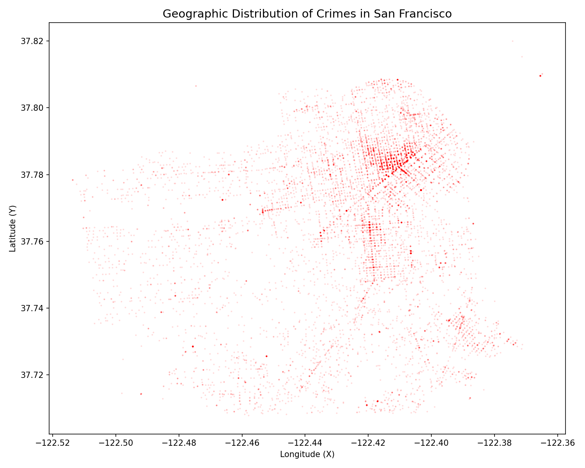
</p>

*Geospatial visualization of crime incidents across the city, illustrating the spatial concentration of criminal activity.*

---

## 🧩 Principal Component Analysis (PCA)

PCA was applied to reduce the dimensionality of the engineered feature space, helping to:
- Minimize redundancy among correlated features.
- Reduce noise and computational cost during training.
- Enable visualization of class separability in a lower-dimensional space.

<p align="center">
  
</p>

*Projection of the dataset onto principal components, illustrating the degree of overlap between crime categories.*

<p align="center">
  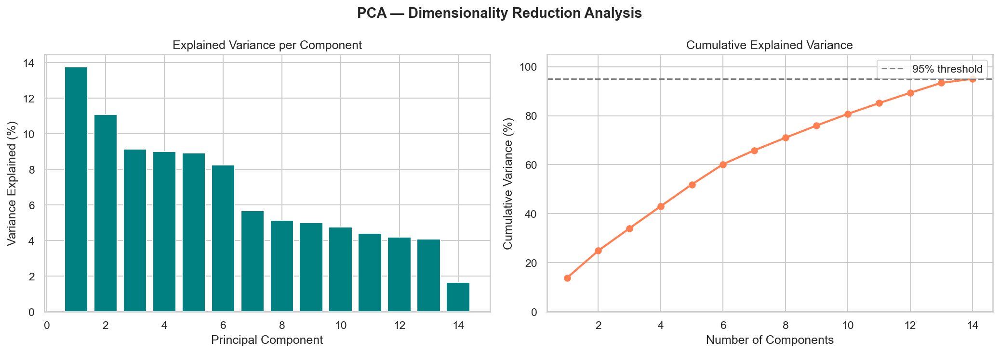
</p>

*Extended analysis of the principal components, further illustrating class separability within the reduced feature space.*

<p align="center">
  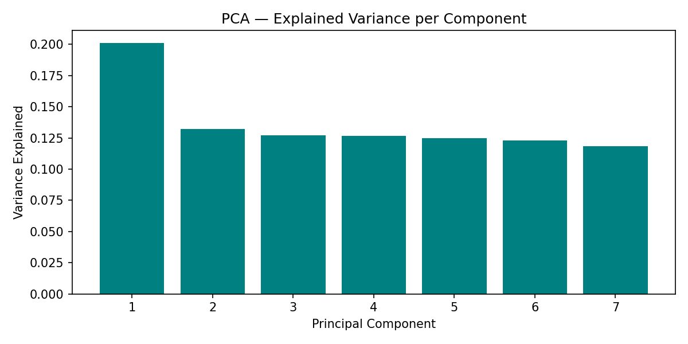
</p>

*Explained variance ratio across principal components, used to determine the number of components retained for modeling.*

---

## 🤖 Models Used

| Model | Purpose | Tuned |
|:---|:---|:---:|
| Logistic Regression | Baseline linear classifier for multi-class prediction | ✅ |
| Decision Tree | Non-linear, interpretable model to capture feature interactions | ✅ |
| Support Vector Machine | Margin-based classifier for complex decision boundaries | ✅ |
| Neural Network | Deep learning model to capture non-linear patterns at scale | ✅ |

---

## ⚙️ Hyperparameter Optimization

Hyperparameter tuning was performed using **[Optuna](https://optuna.org/)**, an automatic hyperparameter optimization framework.

Key aspects of the tuning setup:
- 🗄️ **SQLite storage** — optimization studies are persisted in a SQLite database.
- ⏯️ **Resume interrupted studies** — tuning runs can be paused and resumed without losing progress.
- 🔁 **Reproducibility** — storing trial history ensures consistent, auditable, and repeatable experiments.

---

## 🏆 Results

The **Neural Network** emerged as the top-performing model, achieving an accuracy of approximately **28%** on the crime classification task — substantially outperforming the **~2.6%** random baseline across dozens of crime categories.

<div align="center">

| Metric | Value |
|:---|:---:|
| Random Baseline Accuracy | ~2.6% |
| Neural Network Accuracy | ~28% |

</div>

Considering the large number of crime categories and the severe class imbalance present in the dataset, this result reflects a meaningful and substantial improvement over random guessing, confirming that the engineered features and modeling pipeline successfully capture underlying signal in the data.

---

## 📈 Model Performance Comparison

<p align="center">
  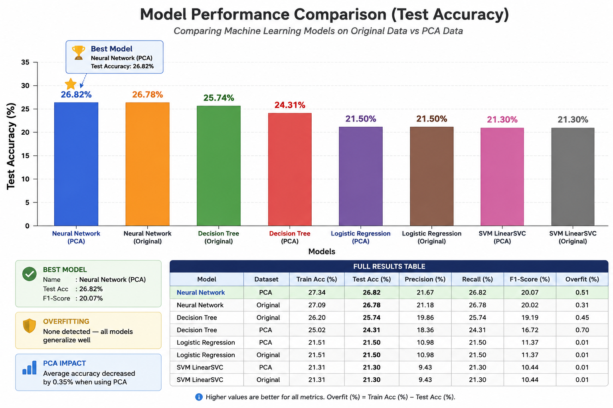
</p>

This comparison highlights the relative accuracy of all evaluated models — Logistic Regression, Decision Tree, Support Vector Machine, and Neural Network — illustrating how the Neural Network consistently outperforms the classical baselines on this multi-class, imbalanced classification task.

---

## 🧠 Neural Network Training

<p align="center">
  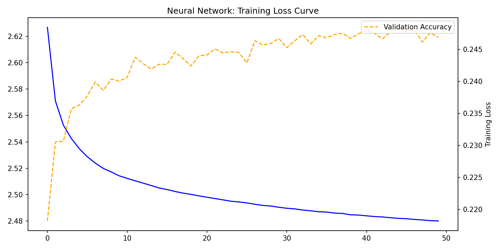
</p>

*Training and validation loss curves across epochs.*

Monitoring the loss curve is essential for understanding how well the neural network is learning over time. A steadily decreasing training loss indicates that the model is successfully fitting the data, while tracking the validation loss alongside it helps identify whether the model is generalizing well or beginning to overfit. This curve was used to guide decisions around training duration and regularization.

---

## 🧮 Confusion Matrices

Confusion matrices provide a detailed, class-by-class view of model performance, revealing not just overall accuracy but *where* each model succeeds and where it tends to misclassify — an especially important lens given the severe class imbalance in this dataset.

### Decision Tree

<p align="center">
  
</p>

*The Decision Tree model shows strong performance on the most frequent crime categories but struggles to correctly classify rarer classes, a direct consequence of the underlying class imbalance.*

<p align="center">
  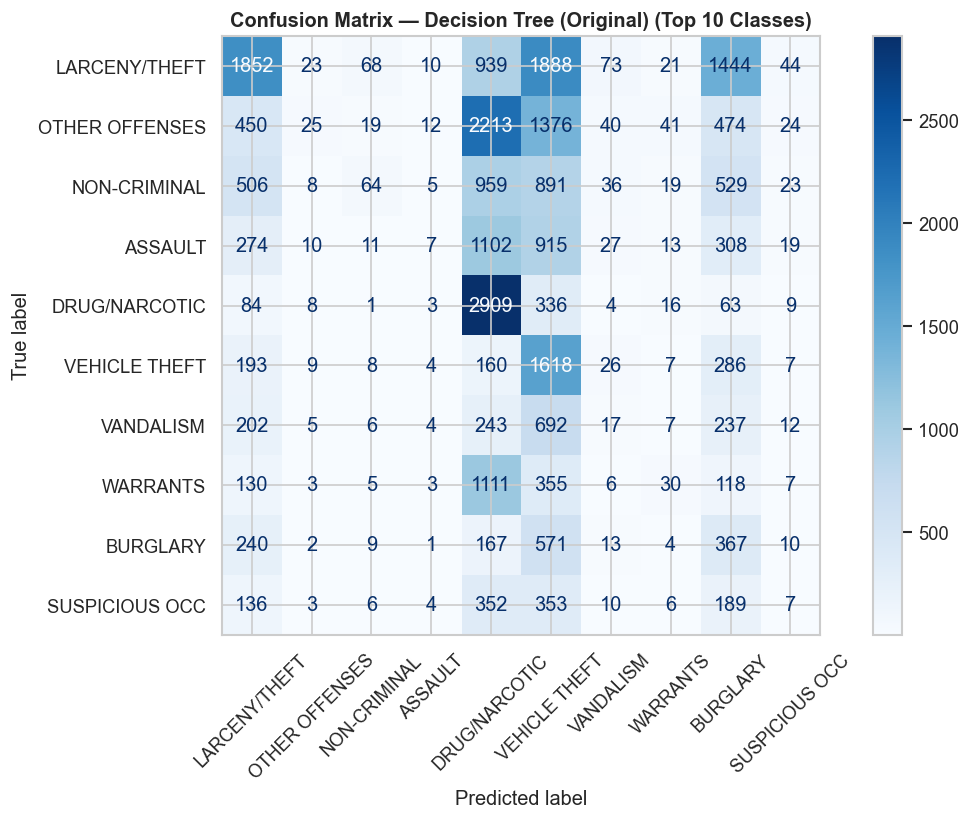
</p>

*The original Decision Tree confusion matrix, offering an additional view of per-class prediction behavior prior to further refinement.*

### Logistic Regression

<p align="center">
  
</p>

*The Logistic Regression model exhibits a bias toward the majority classes, reflecting the impact of class imbalance on linear models.*

<p align="center">
  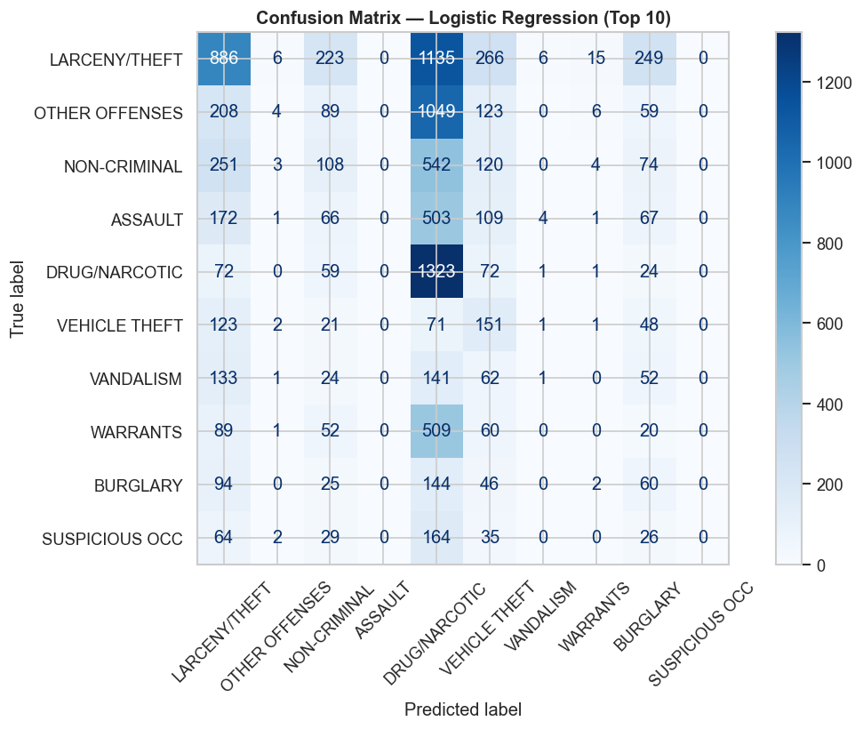
</p>

*A detailed view of the Logistic Regression confusion matrix, further highlighting the model's tendency to favor dominant crime categories.*

### Neural Network Evaluation

<p align="center">
  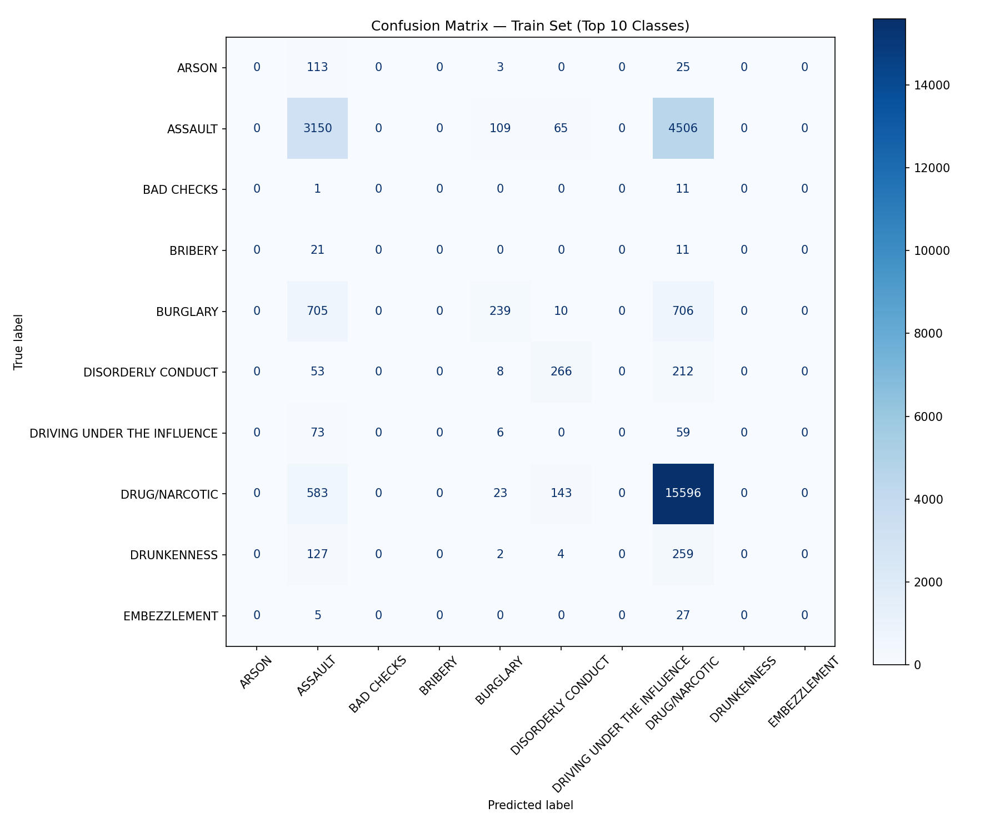
</p>

*Confusion matrix on the training set, showing how well the Neural Network fits the data it was trained on.*

<p align="center">
  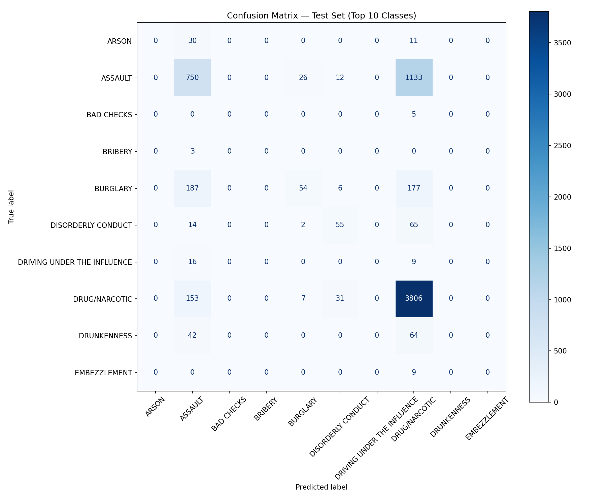
</p>

*Confusion matrix on the held-out test set, reflecting the model's real-world generalization performance and confirming the ~28% accuracy reported above.*

---

## 🧠 Skills Demonstrated

<div align="center">

| | | |
|:---:|:---:|:---:|
| Machine Learning | Data Preprocessing | Feature Engineering |
| Exploratory Data Analysis | Principal Component Analysis | Hyperparameter Optimization |
| Multi-class Classification | Imbalanced Learning | Model Evaluation |
| TensorFlow | Scikit-learn | Optuna |

</div>

---

## 🛠️ Technologies

- **Python** — Core programming language
- **Scikit-learn** — Classical machine learning models and evaluation
- **TensorFlow** — Neural network implementation
- **Pandas** — Data manipulation and analysis
- **NumPy** — Numerical computing
- **Matplotlib** — Data visualization
- **Seaborn** — Statistical visualization
- **Optuna** — Hyperparameter optimization
- **SQLite** — Persistent storage for optimization studies
- **Jupyter Notebook** — Interactive development and analysis

---

## 📁 Repository Structure

```text
san-francisco-crime-classification/
│
├── notebook/
│   └── SF_Crimes_Classification.ipynb
│
├── images/
│   ├── banner.png
│   ├── eda1.png
│   ├── eda2.png
│   ├── eda_overview.png
│   ├── eda_crime_hour.png
│   ├── pca.png
│   ├── pca_analysis.png
│   ├── pipeline.png
│   ├── model_accuracy.png
│   ├── plot1_top15_categories.png
│   ├── plot2_crimes_per_day.png
│   ├── plot3_crimes_per_district.png
│   ├── plot4_crime_by_hour.png
│   ├── plot5_crime_map.png
│   ├── plot6_pca_variance.png
│   ├── plot7_loss_curve.png
│   ├── tree_confusion_matrix.png
│   ├── logistic_confusion_matrix.png
│   ├── cm_decision_tree_(original).png
│   ├── cm_logistic_regression.png
│   ├── confusion_matrix_train.png
│   └── confusion_matrix_test.png
│
├── requirements.txt
├── LICENSE
└── README.md
```

---

## 🚀 Installation

Clone the repository:

```bash
git clone https://github.com/ibrahimsherif-eng/san-francisco-crime-classification.git
cd san-francisco-crime-classification
```

Create a virtual environment:

```bash
python -m venv venv
```

Activate it:

```bash
# Windows
venv\Scripts\activate

# Linux / macOS
source venv/bin/activate
```

Install the dependencies:

```bash
pip install -r requirements.txt
```

Launch Jupyter Notebook to explore the pipeline:

```bash
jupyter notebook
```

---

## 🔮 Future Improvements

- 🌲 Integrate **XGBoost** for gradient-boosted tree performance.
- 💡 Experiment with **LightGBM** for faster training on large datasets.
- 🐱 Explore **CatBoost** for native handling of categorical features.
- 🧠 Improve feature engineering with richer spatial and temporal features.
- 🔬 Enhance deep learning architecture (e.g., embeddings for categorical variables, regularization strategies).
- 🌐 Deploy the model as an interactive web app using **FastAPI** or **Streamlit**.

---

## 📄 License

This project is licensed under the **MIT License**. See the [LICENSE](LICENSE) file for details.

---

<div align="center">

## 👤 Author

**Ibrahim Sherif**
*Machine Learning Engineer*

- GitHub: [@ibrahimsherif-eng](https://github.com/ibrahimsherif-eng)

Built as a graduation project for the **University Machine Learning course**.

<div align="center">

⭐ If you found this project useful, consider giving it a star!

</div>
